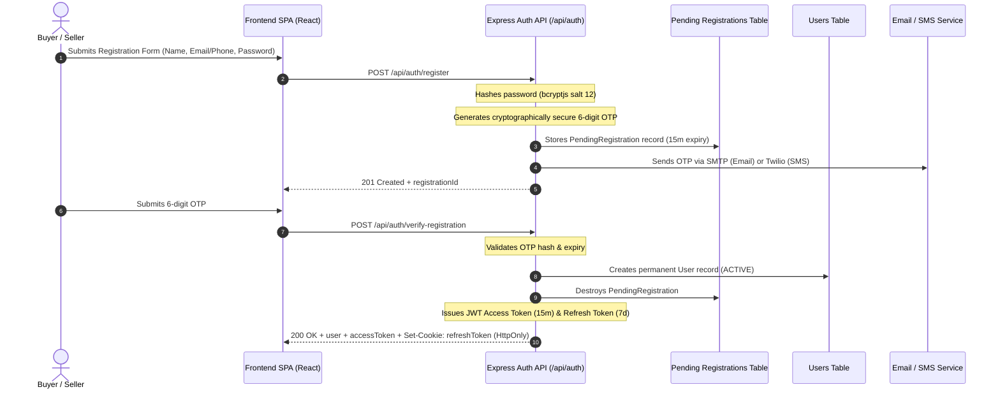

# Vintage Marketplace — Authentication & Identity Architecture

This document details the authentication protocols, token management, security standards, and identity verification integrations in the **Vintage Marketplace** platform.

---

## 1. Authentication Lifecycle



---

## 2. Token Architecture & Security

### 2.1. Access Token (JWT)
* **Algorithm:** HMAC SHA-256 (`HS256`).
* **Secret:** `JWT_SECRET` (minimum 64 characters recommended).
* **Lifespan:** Short-lived (`15m` by default).
* **Payload:**
  ```json
  {
    "sub": "b2c1404e-e192-49da-bf38-51f618a8b1a2",
    "role": "USER",
    "iat": 1724659200,
    "exp": 1724660100
  }
  ```
* **Transmission:** Sent in HTTP headers: `Authorization: Bearer <token>`.

### 2.2. Refresh Token
* **Algorithm:** HMAC SHA-256 (`HS256`).
* **Secret:** `REFRESH_TOKEN_SECRET` (isolated from `JWT_SECRET`).
* **Lifespan:** Long-lived (`7d`).
* **Transmission:** Handled via secure cookie:
  ```typescript
  res.cookie('refreshToken', token, {
    httpOnly: true,
    secure: process.env.NODE_ENV === 'production',
    sameSite: process.env.NODE_ENV === 'production' ? 'none' : 'lax',
    maxAge: 7 * 24 * 60 * 60 * 1000,
  })
  ```
* **Silent Refresh Interceptor:** The frontend Axios client interceptor catches HTTP `401 Unauthorized` responses and automatically attempts token renewal via `/api/auth/refresh` before re-issuing the failed request.

---

## 3. Password Hashing Standards
* **Library:** `bcryptjs`
* **Salt Rounds:** `12`
* **Strength Policy (enforced by Zod schemas):**
  * Minimum 8 characters
  * At least 1 uppercase letter (`[A-Z]`)
  * At least 1 lowercase letter (`[a-z]`)
  * At least 1 digit (`[0-9]`)

---

## 4. Rate Limiting & Brute-Force Mitigations

To protect endpoints against credential stuffing and brute-force attacks:
* **Login Limiter:** `15` requests per IP per 15-minute window (`loginLimiter`).
* **Registration Limiter:** `10` requests per IP per 15-minute window (`registerLimiter`).
* **OTP Verification Limiter:** `20` attempts per IP per 15-minute window (`verifyOtpLimiter`).
* **OTP Resend Limiter:** `5` requests per IP per 15-minute window (`resendOtpLimiter`) with a mandatory 60-second cooldown between resend clicks.

---

## 5. Ethiopian National ID (Fayda / eSignet OIDC)

Vintage Marketplace supports Ethiopian National ID verification through the official **Fayda / eSignet** OpenID Connect (OIDC) flow.

* **Authorization URL:** `FAYDA_AUTHORIZATION_URL` (`https://esignet.ida.et/authorize`)
* **Token Exchange:** `FAYDA_TOKEN_URL` (`https://esignet.ida.et/v1/esignet/oauth/token`)
* **Public Key Validation:** `FAYDA_JWKS_URL`
* **Sandbox Simulation:** Configurable via `FAYDA_SANDBOX_MODE=true` for local development without live partner certificates.
* **Verified Badge:** Successful completion sets `user.is_fayda_verified = true` and displays the verified identity badge on seller listings.
