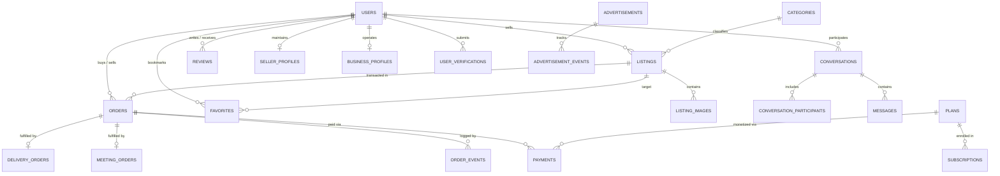

# Vintage Marketplace — Database Schema & Architecture

Vintage Marketplace uses **PostgreSQL** (hosted on **Neon Database**) managed via **Sequelize ORM** (`sequelize-typescript`).

---

## 1. Entity Relationship Diagram (ERD)

---

## 2. Models Inventory (33 Tables)

| Model / Table | Primary Key | Description | Key Foreign Keys |
| :--- | :--- | :--- | :--- |
| `User` (`users`) | `id` (UUID) | User accounts (buyers, sellers, admins) | None |
| `PendingRegistration` (`pending_registrations`) | `id` (UUID) | Transient pre-verified registration holding table | None |
| `PasswordReset` (`password_resets`) | `id` (UUID) | Password reset tokens and OTP state | `user_id` -> `users.id` |
| `SellerProfile` (`seller_profiles`) | `id` (UUID) | Extended seller storefront settings and stats | `user_id` -> `users.id` |
| `BusinessProfile` (`business_profiles`) | `id` (UUID) | Registered enterprise / boutique details | `user_id` -> `users.id` |
| `Category` (`categories`) | `id` (UUID) | Marketplace taxonomy (Electronics, Clothing, etc.) | `parent_id` -> `categories.id` |
| `Listing` (`listings`) | `id` (UUID) | 1-of-1 vintage and pre-owned product listings | `seller_id`, `category_id` |
| `ListingImage` (`listing_images`) | `id` (UUID) | Multi-image URLs, thumbnails, and display orders | `listing_id` -> `listings.id` |
| `Order` (`orders`) | `id` (UUID) | Core commercial transaction and escrow state | `buyer_id`, `seller_id`, `listing_id` |
| `OrderEvent` (`order_events`) | `id` (UUID) | Immutable audit log of order state transitions | `order_id` -> `orders.id` |
| `DeliveryOrder` (`delivery_orders`) | `id` (UUID) | Courier dispatch, address, and live tracking info | `order_id` -> `orders.id` |
| `MeetingOrder` (`meeting_orders`) | `id` (UUID) | In-person public meetup proposal and status | `order_id` -> `orders.id` |
| `Payment` (`payments`) | `id` (UUID) | Chapa payment records, transaction refs, amounts | `user_id`, `order_id`, `plan_id` |
| `Conversation` (`conversations`) | `id` (UUID) | Direct message threads between buyers and sellers | `listing_id` -> `listings.id` |
| `ConversationParticipant` (`conversation_participants`) | `id` (UUID) | User membership in conversation threads | `conversation_id`, `user_id` |
| `Message` (`messages`) | `id` (UUID) | Individual text message in a thread | `conversation_id`, `sender_id` |
| `UserBlock` (`user_blocks`) | `id` (UUID) | Direct user block rules | `blocker_id`, `blocked_id` |
| `Favorite` (`favorites`) | `id` (UUID) | Saved/bookmarked listings | `user_id`, `listing_id` |
| `RecentlyViewed` (`recently_viewed`) | `id` (UUID) | History of browsed items | `user_id`, `listing_id` |
| `Review` (`reviews`) | `id` (UUID) | 1-5 star feedback for completed orders | `order_id`, `seller_id`, `buyer_id` |
| `Report` (`reports`) | `id` (UUID) | User abuse, fraud, and counterfeit reporting | `reporter_id`, `reported_user_id` |
| `UserVerification` (`user_verifications`) | `id` (UUID) | Fayda National ID and Business license documents | `user_id` -> `users.id` |
| `Plan` (`plans`) | `id` (UUID) | Monetization packages (Boosters, Badges) | None |
| `Subscription` (`subscriptions`) | `id` (UUID) | User active plan enrollments | `user_id`, `plan_id` |
| `Entitlement` (`entitlements`) | `id` (UUID) | Granular feature entitlements (extra listings) | `user_id` -> `users.id` |
| `Advertisement` (`advertisements`) | `id` (UUID) | Banner and sidebar advertising campaigns | `user_id`, `plan_id` |
| `AdvertisementEvent` (`advertisement_events`) | `id` (UUID) | Impression and click telemetry | `advertisement_id` |
| `Transaction` (`transactions`) | `id` (UUID) | Platform financial balance transactions | `user_id` -> `users.id` |
| `UserInteraction` (`user_interactions`) | `id` (UUID) | Recommendation scoring event telemetry | `user_id`, `listing_id` |
| `RecommendationEvent` (`recommendation_events`) | `id` (UUID) | Feed recommendation performance analytics | `user_id`, `listing_id` |
| `Notification` (`notifications`) | `id` (UUID) | User push and in-app notifications | `user_id` -> `users.id` |
| `AdminAuditLog` (`admin_audit_logs`) | `id` (UUID) | Immutable audit log of administrative actions | `admin_id` -> `users.id` |

---

## 3. Key Relationships & Cascades

1. **User Deletion:**
   * Deleting a `User` cascades to `SellerProfile`, `BusinessProfile`, and `Favorites`.
   * User references in `Order`, `Payment`, and `AdminAuditLog` are preserved (`ON DELETE RESTRICT` or `SET NULL`) for financial compliance and auditability.
2. **Listing Deletion:**
   * Deleting a `Listing` cascades to `ListingImage`, `Favorite`, and `RecentlyViewed`.
   * Associated completed `Order` records retain immutable snapshots of listing metadata in order history.
3. **Conversations:**
   * Messages are bound to `Conversation` with `ON DELETE CASCADE`.

---

## 4. Indexing Strategy

* **High-Cardinality Query Indexes:**
  * `listings(status, category_id, city, created_at)`: Composite index for fast marketplace filtering and discovery.
  * `orders(buyer_id, status)` and `orders(seller_id, status)`: Fast retrieval of dashboard orders.
  * `messages(conversation_id, created_at)`: Accelerated message timeline rendering.
  * `payments(tx_ref)`: `UNIQUE` index for instant Chapa verification lookups and duplicate payment prevention.
* **Temporal Indexes:**
  * `orders(reservation_expires_at)`: Accelerates the 60-second periodic background reservation cleanup queries.
  * `advertisements(start_date, end_date, is_active)`: Rapid retrieval of active ad slots.

---

## 5. Database Connection Configuration

* **Connection Pool:** Configured via `Sequelize` in `src/config/database.ts`.
* **SSL Requirement:** Configured with `sslmode=require` / `DATABASE_SSL=true` for secure communication with cloud PostgreSQL providers (Neon).
* **Automatic Synchronization:** In development mode, `sequelize.authenticate()` validates schema connectivity. In production, schema stability is preserved.
