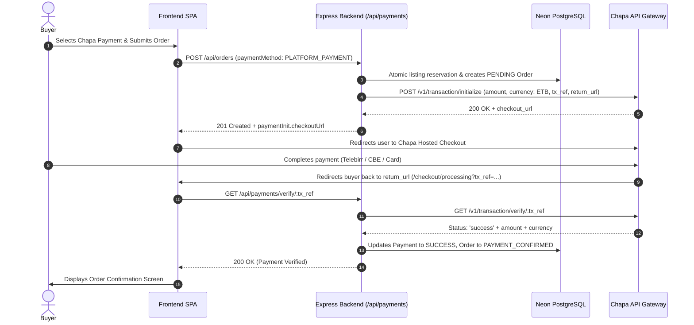

# Vintage Marketplace — Chapa Ethiopian Payment Gateway Integration

This document specifies the integration architecture, payment flow, validation constraints, and security controls for processing Ethiopian digital payments through **Chapa** (`https://api.chapa.co`).

---

## 1. Overview

Chapa is the primary payment provider for Vintage Marketplace, enabling buyers to pay securely using:
* **Telebirr**
* **CBE Birr (Commercial Bank of Ethiopia)**
* **AwashBirr**
* **Bank of Abyssinia & Ethiopian Mobile Banking**
* **Visa & Mastercard**



---

## 2. API Specifications & Constraints

### 2.1. Initialization Payload
Endpoint: `POST https://api.chapa.co/v1/transaction/initialize`  
Headers: `Authorization: Bearer <CHAPA_SECRET_KEY>`, `Content-Type: application/json`

```json
{
  "amount": "1500.00",
  "currency": "ETB",
  "email": "customer@vintagemarket.et",
  "first_name": "Abebe",
  "last_name": "Kebede",
  "phone_number": "0911223344",
  "tx_ref": "ORDER-BONDA-2026-104928-1724659200",
  "callback_url": "https://vintage-marketplace-6.onrender.com/api/payments/webhook",
  "return_url": "https://vintage-marketplace-tau.vercel.app/checkout/processing?ref=ORDER-BONDA-2026-104928-1724659200",
  "customization": {
    "title": "Vintage Market",
    "description": "Payment for Pioneer Bluetooth Stereo"
  }
}
```

### 2.2. Strict Validation Constraints
* **`customization.title`:** **MUST NOT exceed 16 characters**. (We use `'Vintage Market'` — 14 characters).
* **`tx_ref`:** Must be globally unique across all Chapa merchants. We prefix transaction references with domain identifiers (`ORDER-`, `BOOST-`, `SUB-`).
* **`currency`:** Must be `ETB` (Ethiopian Birr) or `USD`.

---

## 3. Webhooks & Asynchronous Verification

Chapa dispatches webhook events to the configured `callback_url`:

* **Endpoint:** `POST /api/payments/webhook`
* **HMAC Signature Verification:** The webhook signature (if enabled) is verified using `CHAPA_SECRET_KEY`.
* **Idempotency:** The backend checks whether `payment.status === 'COMPLETED'` before executing status transitions, preventing duplicate order updates.

---

## 4. Security & Isolation Rules

1. **Zero Frontend Secret Exposure:** `CHAPA_SECRET_KEY` is exclusively consumed in backend services. The frontend never accesses or proxies secret credentials.
2. **Authoritative Amount Calculation:** The payment amount sent to Chapa is calculated server-side from PostgreSQL records (listing price + calculated delivery fee + platform fee). Client-supplied amount overrides are strictly rejected.
3. **Escrow Hold:** Funds remain safely held in platform escrow until the buyer confirms delivery or the in-person meeting exchange completes successfully.
