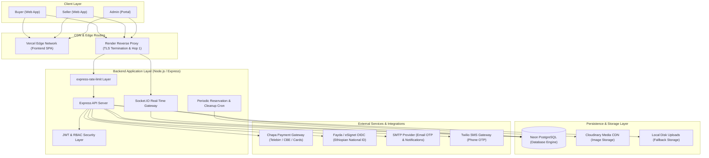
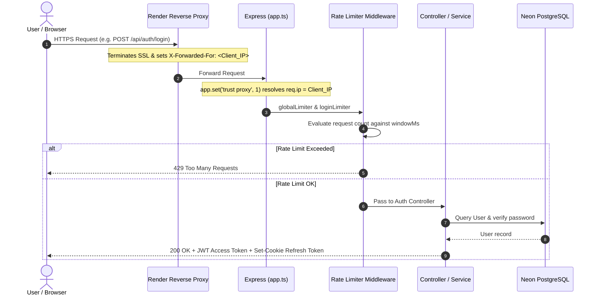
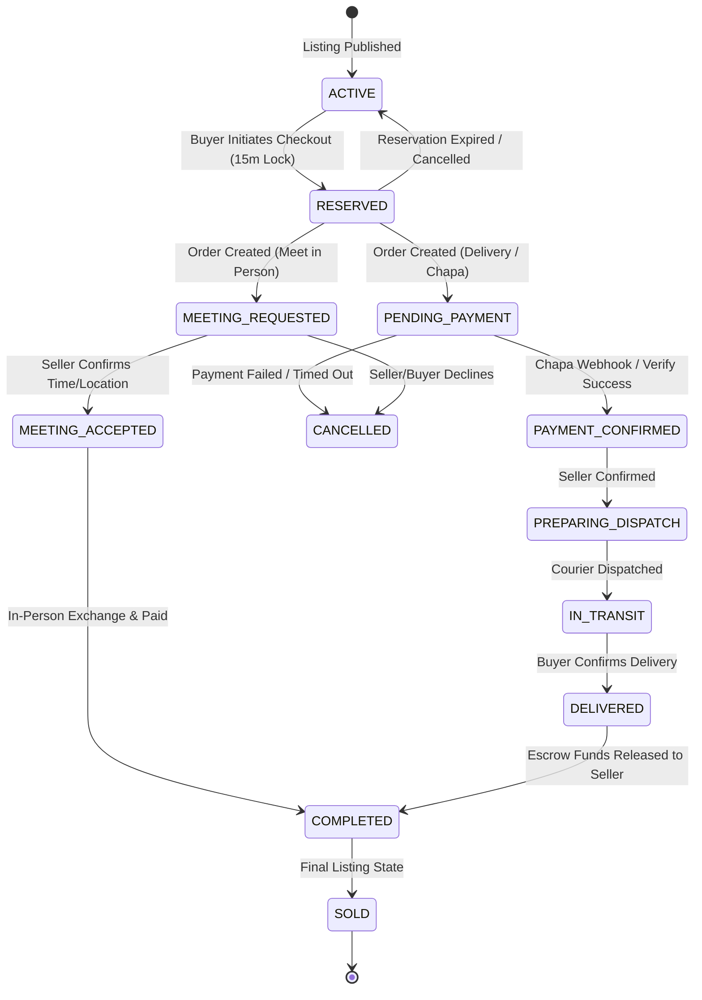
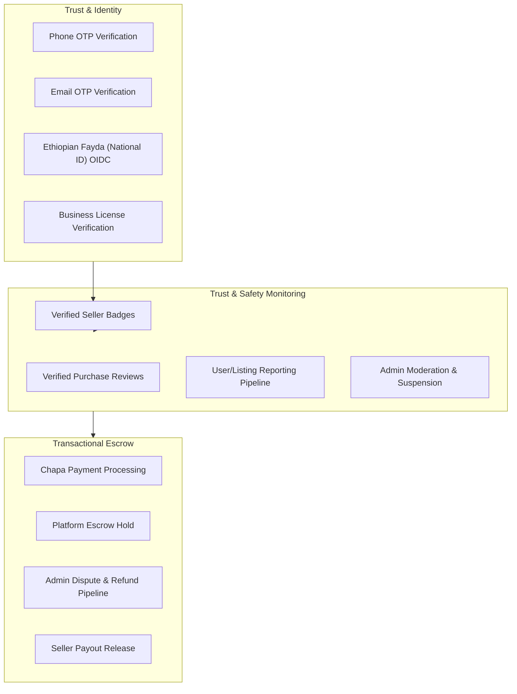

# Vintage Marketplace — System Architecture

This document details the architectural design, component interactions, data flows, and infrastructure topology of the **Vintage Marketplace** platform.

---

## 1. High-Level Architecture Overview

Vintage Marketplace is designed as a distributed, decoupled client-server architecture tailored for secure, high-performance commerce in Ethiopia.

---

## 2. Component Layers

### 2.1. Frontend Architecture (React 19 + Vite + TypeScript)
* **Framework:** React 19 SPA bundled with Vite 8.
* **Routing:** React Router v7 with protected route wrappers (`RequireAuth`, `RequireAdmin`).
* **State Management:**
  * Context API (`AuthContext`, `SocketContext`) for global session and real-time connectivity.
  * Local component state for forms, filters, and UI modals.
* **Styling & UI:** Tailwind CSS v4 with curated design tokens, Lucide icons, and responsive layouts.
* **Networking:** Axios with request/response interceptors for automatic JWT renewal via refresh token cookies.

### 2.2. Backend Architecture (Node.js 20+ / Express 5 / TypeScript)
* **API Paradigm:** RESTful API with structured `{ success: boolean, message?: string, data?: any, errors?: any }` response envelopes.
* **Entry Points:**
  * `src/server.ts`: Database bootstrapping, background worker initialization, HTTP server creation, and Socket.IO attachment.
  * `src/app.ts`: Express routing pipeline, security middleware (`helmet`, `cors`), `trust proxy 1` configuration, request parsers, and global error handlers.
* **Data Access Layer:** Sequelize ORM with TypeScript models, transaction management (`sequelize.transaction`), row-level locking (`SELECT ... FOR UPDATE`), and PostgreSQL operators.
* **Observability:** Centralized error handler with production stack trace sanitization and server-side log output for Render monitoring.

---

## 3. Core Request Lifecycles

### 3.1. Reverse Proxy & Rate Limiting Pipeline

---

### 3.2. Atomic Order & Reservation State Machine
All 1-of-1 vintage listings are protected against race conditions using row-level locking and temporal reservations:

---

## 4. Real-Time Socket.IO Infrastructure

The platform integrates Socket.IO for instant messaging, read receipt tracking, and contextual notifications.

* **Authentication:** Handshake queries and headers carry JWT access tokens, validated by `socket.use()` middleware.
* **Room Isolation:**
  * **User Room:** `user:{userId}` — used for notifications, order status changes, and global unread counters.
  * **Conversation Room:** `conversation:{conversationId}` — used for live message broadcasting, typing indicators, and real-time read receipts.
* **Persistence:** Messages are saved to PostgreSQL inside database transactions before broadcasting to connected room sockets.

---

## 5. Security & Trust Layer

